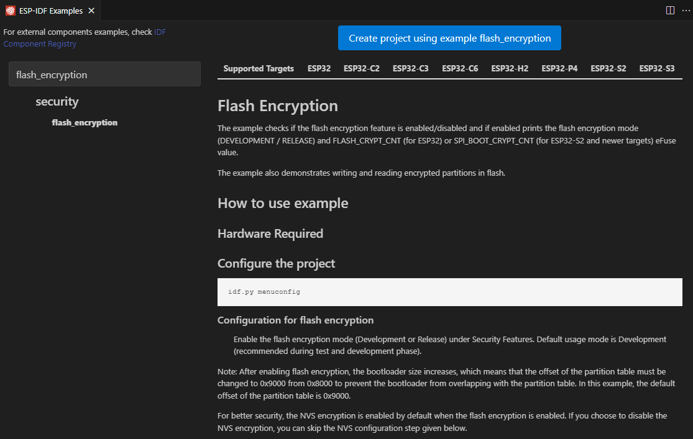

# Flash Encryption

Flash Encryption secures the device's flash memory contents. Once enabled, the firmware is uploaded in plaintext but becomes encrypted on the first boot, thus preventing unauthorized flash readouts. For more details, refer to the [ESP-IDF Flash Encryption documentation](https://docs.espressif.com/projects/esp-idf/en/latest/esp32/security/flash-encryption.html).

Let's open an ESP-IDF project. For this tutorial, we will use the `security/flash_encryption` example.

1. Click the View menu -> Command Palette... and search for the **ESP-IDF: Show Example Projects** command, then choose `Use Current ESP-IDF (/path/to/esp-idf)`. If you don't see this option, please review the setup in the [Installation tutorial](./install.md).

2. A window will open with a list of projects. Search for `flash_encryption`. You will see a **Create project using example flash_encryption** button at the top and a description of the project below. Click the button, and the project will open in a new window.

   

3. Configure the project by setting up the following:
    - Select the Port to Use
    - Set the Espressif Device Target
    - Set the Flashing Method to UART

   > **NOTE:** In case this step is not clear, take a look at the [Basic Use Tutorial](./basic_use.md).

4. Use the Command Palette with `ESP-IDF: SDK Configuration editor (Menuconfig)` to open the SDK Config Menu. Search for **flash encryption** and enable the following option:

   

   > **IMPORTANT**: Enabling flash encryption limits the options for further updates of the ESP32. Before using this feature, read the document and make sure to understand the implications. [ESP-IDF Flash Encryption documentation](https://docs.espressif.com/projects/esp-idf/en/latest/esp32/security/flash-encryption.html)

5. Build the project.

6. Flash the project.

   > **NOTE**: The first flash will upload the firmware without using the `--encrypt` flag. After flashing is complete, you will need to reset your device by pressing the reset button on the board. (The button may be labeled as "RESET", "RST", or "EN")

7. Flash the firmware once again, this time if all the steps were followed correctly, the `--encrypt` flag will be automatically added.
